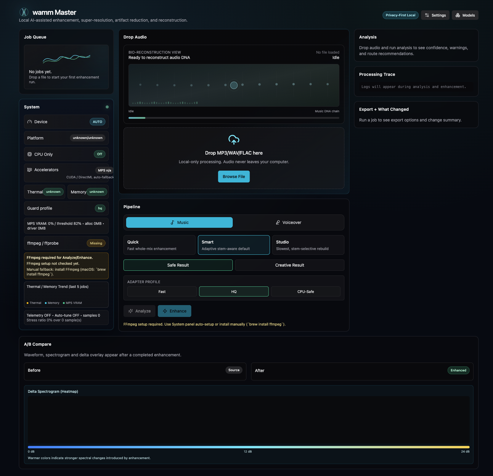
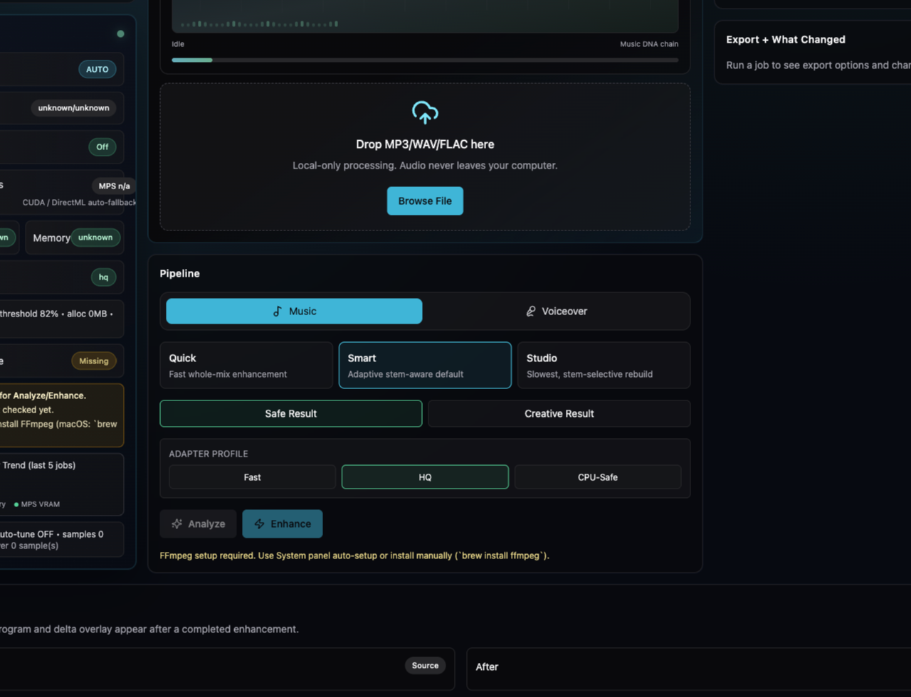
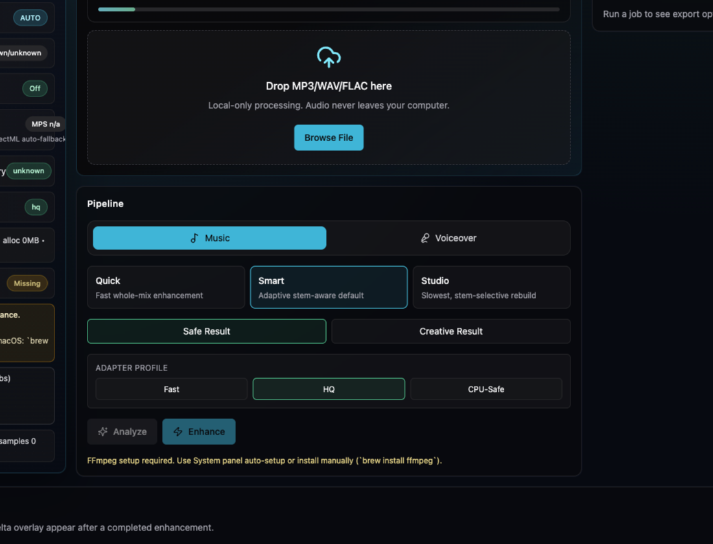
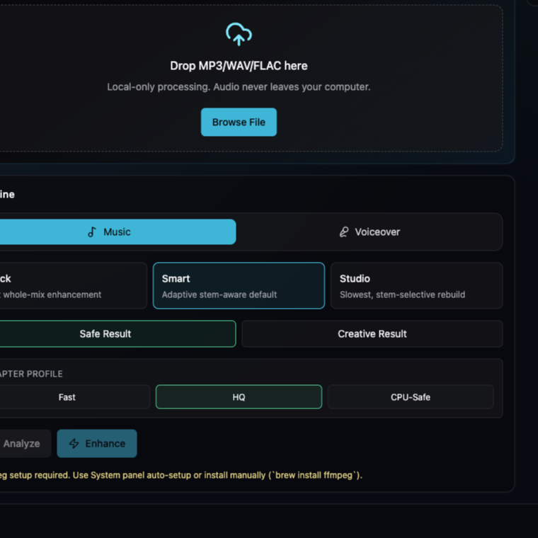

# wamm Master

`wamm Master`, düşük kaliteli ses kayıtlarını modern dinleme standartlarına taşıyan, masaüstünde yerel çalışan bir **AI audio reconstruction** uygulamasıdır.

Özellikle şu kullanım senaryolarına odaklanır:
- AI üretilmiş müzikler (özellikle MP3 kaynaklı band daralması yaşayan üretimler)
- Kötü encode edilmiş demo kayıtları
- Voiceover / podcast / anlatım sesleri

Hedefimiz:
- yalnızca sesi “yüksek” yapmak değil,
- frekans alanını yeniden inşa ederek algısal netlik, derinlik ve sahne hissini artırmak,
- yaratıcı üretimlerde **studio-grade ve ötesi** bir dinleme deneyimine yaklaşmak.

## Neden wamm Master?

Çünkü müzik ve konuşma aynı problem değil.

wamm Master iki ayrı motorla çalışır:
- `Music Mode`: armonik yapı, transient davranışı, bass stabilitesi, stem duyarlılığı
- `Voiceover Mode`: intelligibility, sibilance kontrolü, gürültü temizliği, doğal ton

Bu ayrım, tek modelle her içeriği “aynı şekilde parlatan” araçlara göre çok daha tutarlı sonuç üretir.

## Teknik Çekirdek (Model Mimarisı)

### Music zinciri
- `UniverSR` (primary): geniş bant yeniden yapılandırma ve yüksek kalite SR
- `AudioSR` (stable fallback): olgun ve geniş uyumlu fallback motor
- `BS-RoFormer` (stem route): vokal/drum/bass/other ayrıştırma tabanlı seçici onarım
- `Demucs` (compat fallback): uyumluluk için ikinci separation fallback

### Voiceover zinciri
- `ClearVoice` (HQ path): kaliteli konuşma restoration ve speech enhancement
- `LavaSR` (fast path): hızlı local speech SR/restore
- `Resemble Enhance` (finish): algısal son katman, presence & tone finisher
- `DeepFilterNet` (denoise): düşük compute ile gerçek zaman odaklı gürültü temizliği

## Sesi Nasıl Geliştiriyor?

wamm Master, enhancement sürecini bir mastering preset’i gibi değil, **analysis-first reconstruction** şeklinde yürütür:

1. Kaynağı analiz eder (cutoff, spectral hole, noise floor, harmonic/transient yoğunluğu).
2. İçeriğe göre doğru pipeline’ı seçer (music/voice ve preset tabanlı).
3. MP3 kaynaklarda cutoff-aware preconditioning uygular.
4. Gerekirse stem-selective route açar.
5. Confidence-aware blending ile riskli bantlarda kontrollü karışım yapar.
6. Safe/Creative çıktıları karşılaştırmalı sunar.

Sonuç:
- daha açık üst frekanslar,
- daha temiz mid bölgesi,
- daha kontrollü transientler,
- daha stabil stereo alan.

## Artistik Deneyim

Uygulama arayüzü “DNA reconstruction” temasına sahiptir:
- analiz aşamasında hücre tarama hissi,
- yeniden inşa aşamasında split/merge helix hareketi,
- finalize aşamasında spektral stabilizasyon animasyonları.

Bu görsel dil, kullanıcıya işlemin hangi aşamada olduğunu sezgisel olarak anlatır ve yalnızca teknik değil artistik bir üretim hissi sunar.

## Ekran Görselleri ve Kullanım Akışı

### 1) Ana çalışma alanı

### 2) Analysis + Recommendation
Dosyayı yükledikten sonra uygulama içerik analizi yapar, önerilen zinciri seçer ve confidence/warning kartlarını gösterir.

### 3) Processing + A/B Compare
Enhancement tamamlandığında before/after ve delta görüntüsü üzerinden kulakla karşılaştırma yapılır.

### 4) System + Runtime Guard
Device, accelerator, thermal/memory guard ve FFmpeg durumları canlı takip edilir.

## Nasıl Kullanılır?

1. Son sürümü indirin: [Latest Release](https://github.com/WeAreTheArtMakers/audio-upscale/releases/latest)
2. Ses dosyanızı sürükleyip bırakın (`MP3`, `WAV`, `FLAC`, `M4A`, `AAC`, `OGG`, `OPUS`)
3. `Music` veya `Voiceover` modunu seçin
4. `Analyze` ile analiz edin
5. `Enhance` ile işlemi başlatın
6. A/B karşılaştırma yapın
7. Çıktıyı `WAV` (primary), opsiyonel `FLAC` / `MP3` olarak export edin

## Platform Desteği

- macOS (Apple Silicon öncelikli)
- Windows
- Linux

## Sürekli Geliştirme Yaklaşımı

wamm Master, düşük kaliteli kaynakların gelişimi için yaşayan bir ürün yol haritasına sahiptir:
- model adaptörleri güncellenir,
- cutoff/denoise/stem karar sistemi iyileştirilir,
- yeni araştırmalar üretim pipeline’ına kontrollü şekilde entegre edilir.

Her sürümde amaç, aynı dosyadan daha iyi algısal kaliteye ulaşmaktır.

## Bağlantılar

- Landing Page: `docs/index.html`
- Activation Guide: `docs/activation.html`
- Site config: `docs/site-config.json`
